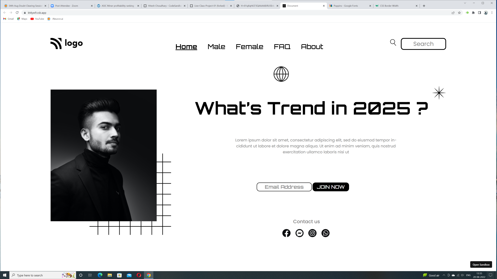

# Live Project 1

## Simple landing page website.

## See live [Live-Project-1](#)



### Time took to complete this project : 4hrs .
### Learn so much new css properties .


### The z-index property specifies the stack order of an element.
```

.img-man {
  position: absolute;
  top: 120px;
  z-index: 1;
}

```

### Displays an element as an inline element (like <span>)

```
display: inline;

```

### By completing this project i learn about **Position** , **Z-index** , **Display properties** and many more things .

### I enjoyed a lot doing this project.
